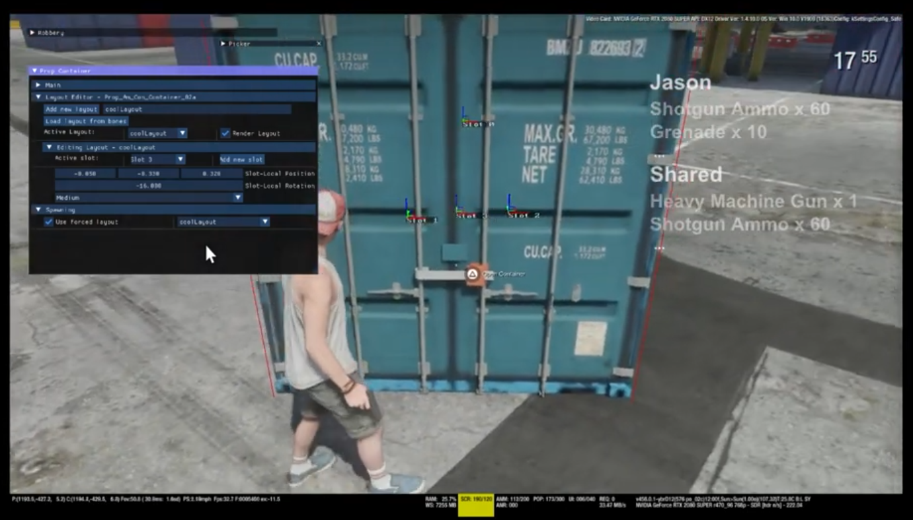

# IMGUI Demo
showing demo screen of imgui using vulkan renderer

# Screenshot

# What is ImGui?
ImGui (Immediate Mode Graphical User Interface) is a bloat-free graphical user interface library for C++. It is designed to enable fast iterations and to empower programmers to create content creation tools and visualization/debug tools with ease.

# Learn more about ImGui
For more information about ImGui, visit the [official ImGui repository](https://github.com/ocornut/imgui).

### GTA 6 Debug
